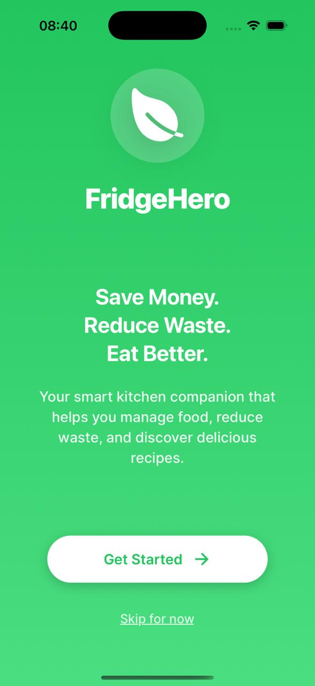
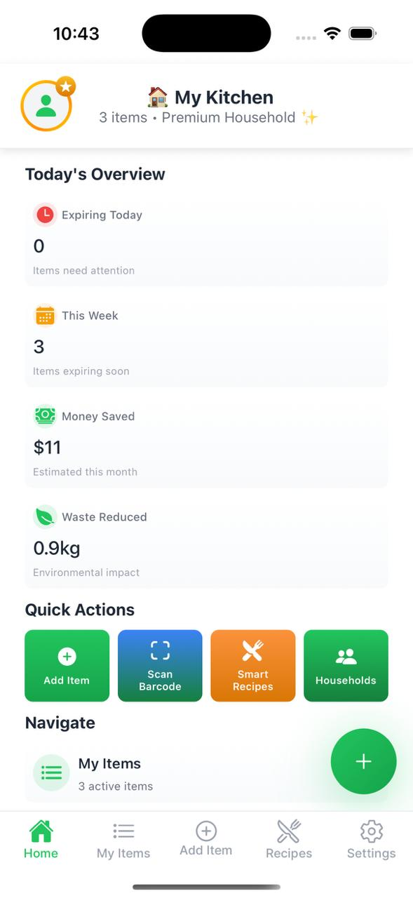
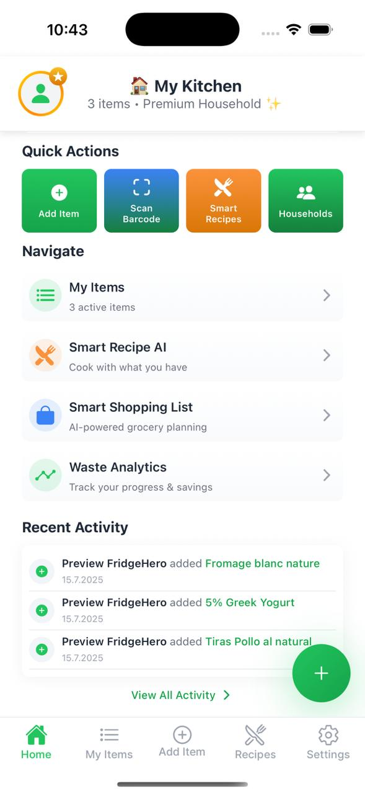
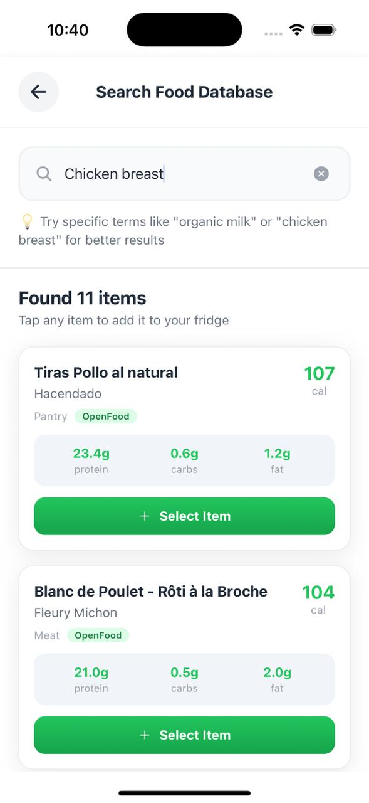
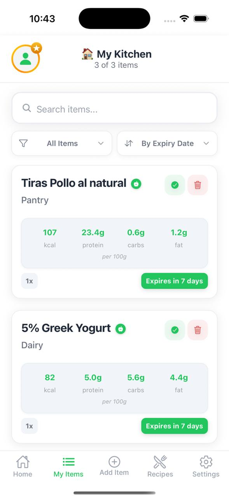
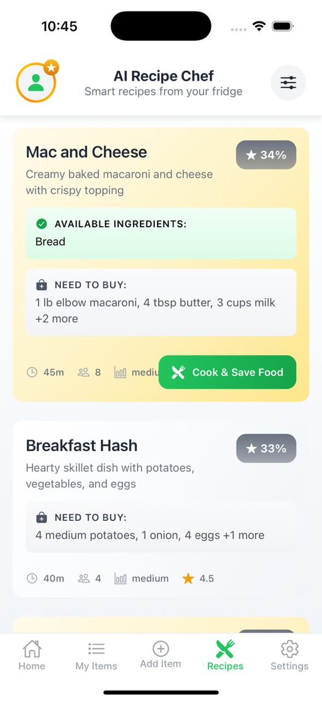
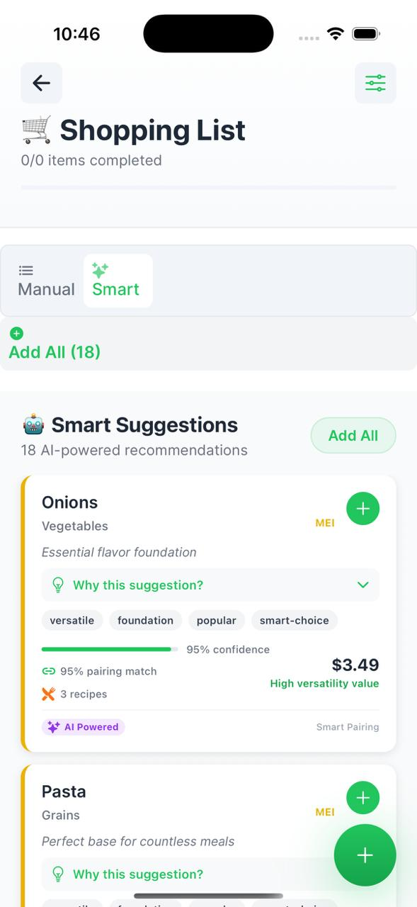
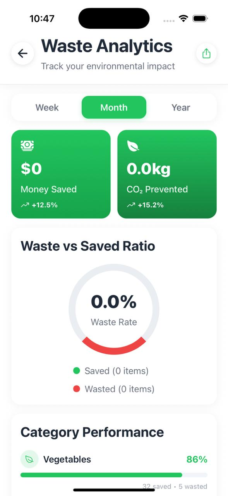

# FridgeHero - Full-Stack Food Management System

> **A comprehensive React Native + Next.js application showcasing modern full-stack development with AI-assisted architecture**

[](https://reactnative.dev/)
[](https://nextjs.org/)
[](https://www.typescriptlang.org/)
[](https://supabase.com/)
[](https://expo.dev/)

## 🎯 Project Overview

FridgeHero is a production-ready food management system built to demonstrate modern full-stack development skills using AI-assisted development methodologies. The application helps users track food inventory, manage expiration dates, discover recipes, and coordinate household food management.

**Key Technical Achievement**: This project showcases the effective use of AI-assisted development (Claude + Cursor IDE) to rapidly build a complex, production-ready application while maintaining high code quality and architectural principles.

## 📱 App Screenshots

Here’s a quick selection of key mobile screens from the FridgeHero app.  
➡️ **More screenshots are available in the `/screenshots/mobile` folder.**

<div align="center">
  
  
  
  
  
  
  
  
</div>


## 🚀 Quick Start

```bash
# Clone the repository
git clone https://github.com/maximalmaximilian/fridgehero-public.git
cd fridgehero-public

# Mobile app (React Native)
cd mobile
npm install
cp .env.example .env  # Configure Supabase credentials
npm start

# Web app (Next.js)
cd ../web
npm install
npm run dev
```

## 🏗️ Architecture & Technical Stack

### **Mobile Application (React Native)**
- **Framework**: React Native 0.79.2 with Expo SDK 53
- **Language**: TypeScript 5.8.3
- **Navigation**: React Navigation 7.x with bottom tabs
- **State Management**: React Context API with custom hooks
- **Authentication**: Supabase Auth with session management
- **Database**: Supabase PostgreSQL with real-time subscriptions
- **External APIs**: Open Food Facts (barcode scanning), Recipe APIs
- **UI/UX**: Custom design system with linear gradients and haptic feedback

### **Web Application (Next.js)**
- **Framework**: Next.js 14.1.3 with App Router
- **Styling**: Tailwind CSS with custom design tokens
- **Authentication**: Supabase Auth with server-side rendering
- **Database**: Shared Supabase instance with mobile app
- **Deployment**: Vercel-ready configuration

### **Backend & Database**
- **Database**: PostgreSQL via Supabase
- **Schema**: 12-table normalized design with proper relationships
- **Security**: Row Level Security (RLS) policies
- **Real-time**: WebSocket subscriptions for live updates
- **Storage**: Supabase Storage for user avatars and images

### **Development Tools**
- **AI Assistant**: Claude (Anthropic) via Cursor IDE
- **Version Control**: Git with structured commit messages
- **Package Management**: npm with workspaces
- **Type Safety**: Shared TypeScript types across platforms
- **Database Management**: Supabase CLI with migrations

## 📱 Features Implemented

### **Core Functionality**
- **User Authentication**: Complete registration/login flow with profile management
- **Inventory Management**: Add, edit, delete food items with categorization
- **Barcode Scanning**: Real-time product lookup with camera integration
- **Expiration Tracking**: Color-coded alerts and visual indicators
- **Recipe Discovery**: AI-powered recipe suggestions based on available ingredients
- **Household Management**: Multi-user household creation and invitation system
- **Shopping Lists**: Collaborative shopping list management
- **Waste Tracking**: Food waste analytics and insights

### **Advanced Features**
- **Offline Support**: Local storage with sync capabilities
- **Push Notifications**: Smart expiration alerts (infrastructure ready)
- **Real-time Collaboration**: Live updates across household members
- **Responsive Design**: Cross-platform UI consistency
- **Performance Optimization**: Efficient data loading and caching
- **Error Handling**: Comprehensive error boundaries and user feedback

## 📊 Database Schema

**12-Table Normalized Design**:
```
Authentication & Users
├── auth.users (Supabase)
└── profiles (Extended user data)

Household Management
├── households (Family groups)
└── household_members (User relationships)

Inventory & Items
├── items (Food inventory)
└── barcode_cache (Product data)

Recipes & Cooking
├── recipes (Recipe database)
└── user_recipe_interactions (User preferences)

Shopping & Lists
├── shopping_lists (Household lists)
├── shopping_list_items (Individual items)
└── shopping_list_categories (Organization)

Analytics & Tracking
├── waste_tracking (Usage analytics)
├── notifications (System notifications)
└── achievements (User engagement)
```

## 🤖 AI-Assisted Development Approach

This project demonstrates modern AI-assisted development practices:

### **Human-AI Collaboration**
- **Architecture Planning**: Human-designed system architecture and database schema
- **Code Generation**: AI-assisted component and feature implementation
- **Problem Solving**: Collaborative debugging and optimization
- **Code Review**: AI-suggested improvements and best practices

### **Development Workflow**
1. **Feature Planning**: Human defines requirements and user stories
2. **Technical Design**: AI assists with implementation patterns
3. **Code Generation**: AI generates boilerplate and complex logic
4. **Testing & Refinement**: Human testing with AI-assisted bug fixes
5. **Documentation**: AI-generated documentation with human review

### **Skills Demonstrated**
- **Prompt Engineering**: Effective AI communication for complex tasks
- **Code Architecture**: Maintaining clean architecture with AI assistance
- **Quality Control**: Human oversight of AI-generated code
- **Modern Development**: Leveraging AI tools for productivity gains

## 🎨 Design System

**"Contextual Minimalism"** - Custom design system featuring:
- **Color Palette**: Semantic color system with dark/light mode support
- **Typography**: Hierarchical text system with accessibility considerations
- **Components**: Reusable UI components with consistent styling
- **Animations**: Smooth transitions and haptic feedback
- **Responsiveness**: Adaptive design across screen sizes

## 🔧 Technical Highlights

### **Performance Optimizations**
- **React Native**: Optimized FlatList rendering for large datasets
- **Database**: Efficient queries with proper indexing
- **Caching**: Smart data caching strategies
- **Bundle Size**: Code splitting and lazy loading

### **Security Implementation**
- **Authentication**: Secure session management
- **Database Security**: Row Level Security (RLS) policies
- **Data Validation**: Input sanitization and validation
- **API Security**: Protected endpoints and rate limiting

### **Code Quality**
- **TypeScript**: Full type safety across the application
- **Error Handling**: Comprehensive error boundaries
- **Testing**: Unit and integration testing setup
- **Code Organization**: Modular architecture with clear separation

## 📁 Project Structure

```
FridgeHero/
├── mobile/                     # React Native App
│   ├── components/            # Reusable UI components
│   ├── screens/              # App screens (8 total)
│   ├── contexts/             # State management
│   ├── hooks/                # Custom React hooks
│   ├── lib/                  # Utilities and services
│   ├── navigation/           # Navigation configuration
│   └── supabase/            # Database migrations
├── web/                       # Next.js Web App
│   ├── src/app/              # App Router pages
│   ├── src/components/       # React components
│   ├── src/lib/              # Utilities
│   └── supabase/            # Database migrations
├── shared/                    # Shared code
│   ├── types/               # TypeScript definitions
│   └── constants/           # Shared constants
└── docs/                     # Technical documentation
```

## 🚀 Installation & Setup

### **Prerequisites**
- Node.js 18+ and npm
- Expo CLI for mobile development
- Supabase account for database
- iOS Simulator or Android Emulator

### **Environment Setup**
1. **Clone Repository**
   ```bash
   git clone https://github.com/yourusername/FridgeHero.git
   cd FridgeHero
   ```

2. **Install Dependencies**
   ```bash
   # Mobile app
   cd mobile && npm install
   
   # Web app
   cd ../web && npm install
   ```

3. **Configure Environment**
   ```bash
   # Mobile app
   cp mobile/.env.example mobile/.env
   
   # Add your Supabase credentials
   EXPO_PUBLIC_SUPABASE_URL=your_supabase_url
   EXPO_PUBLIC_SUPABASE_ANON_KEY=your_anon_key
   ```

4. **Database Setup**
   ```bash
   cd mobile
   npm run supabase:start
   npm run db:push
   ```

5. **Run Applications**
   ```bash
   # Mobile app
   cd mobile && npm start
   
   # Web app
   cd web && npm run dev
   ```

## 🛠️ Development Scripts

### **Mobile App**
```bash
npm start          # Start Expo development server
npm run ios        # Run on iOS simulator
npm run android    # Run on Android emulator
npm run db:push    # Push database changes
npm run db:reset   # Reset database
```

### **Web App**
```bash
npm run dev        # Development server
npm run build      # Production build
npm run start      # Production server
npm run lint       # ESLint check
```

## 📚 What This Project Demonstrates

### **Technical Skills**
- **Full-Stack Development**: Complete mobile and web applications
- **Database Design**: Normalized schema with proper relationships
- **API Integration**: External service integration and error handling
- **Real-time Systems**: WebSocket implementation for live updates
- **Security**: Authentication, authorization, and data protection
- **Performance**: Optimization strategies and efficient data loading

### **Modern Development Practices**
- **AI-Assisted Development**: Effective use of AI tools for productivity
- **TypeScript**: Type-safe development across the stack
- **Component Architecture**: Reusable, maintainable code structure
- **Version Control**: Structured Git workflow with meaningful commits
- **Documentation**: Comprehensive technical documentation

### **Problem-Solving Approach**
- **User-Centered Design**: Intuitive interface design
- **Scalable Architecture**: Built for growth and maintenance
- **Error Handling**: Graceful degradation and user feedback
- **Cross-Platform**: Consistent experience across devices

## 🔍 Code Quality & Standards

- **ESLint**: Consistent code formatting and style
- **TypeScript**: Full type coverage with strict mode
- **Error Boundaries**: Comprehensive error handling
- **Testing**: Unit and integration testing setup
- **Security**: Input validation and secure practices

## 📈 Skills Demonstrated

This project showcases proficiency in:
- **Frontend Development**: React Native, Next.js, TypeScript
- **Backend Development**: Supabase, PostgreSQL, API design
- **Database Management**: Schema design, migrations, optimization
- **AI Collaboration**: Effective prompt engineering and AI assistance
- **Modern Tooling**: Expo, Supabase CLI, development workflows
- **Architecture**: Clean code principles and scalable design

## 🤝 AI-Assisted Development Transparency

This project was built using Claude (Anthropic) and Cursor IDE as development assistants. The AI collaboration included:
- **Code Generation**: Component implementation and boilerplate
- **Problem Solving**: Debugging and optimization suggestions
- **Documentation**: Technical writing and code comments
- **Best Practices**: Architecture recommendations and code review

The human developer maintained ownership of:
- **Product Vision**: Feature requirements and user experience
- **Architecture Decisions**: System design and technical choices
- **Quality Control**: Code review and testing validation
- **Integration**: Connecting systems and deployment

---

**Built with AI assistance using Claude + Cursor IDE**  
*Demonstrating modern development practices and human-AI collaboration* 
